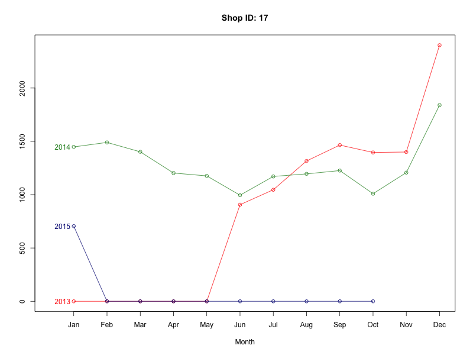
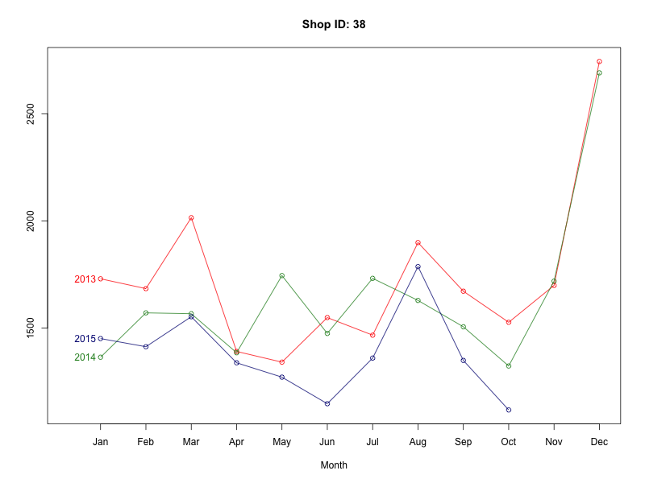
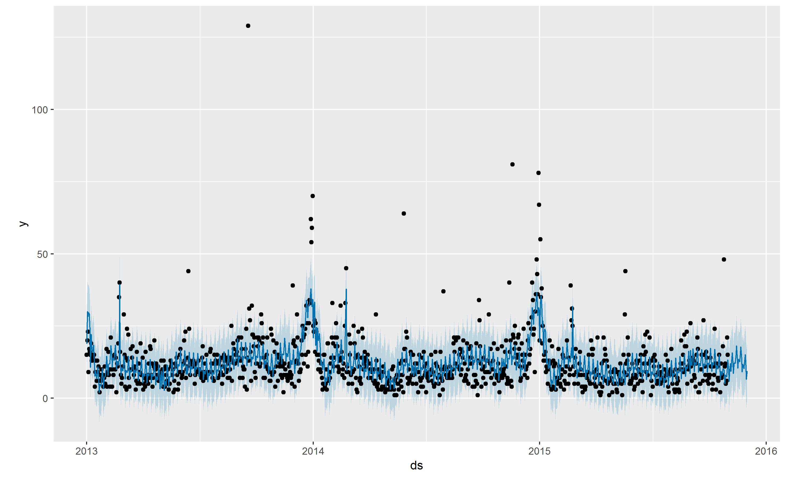
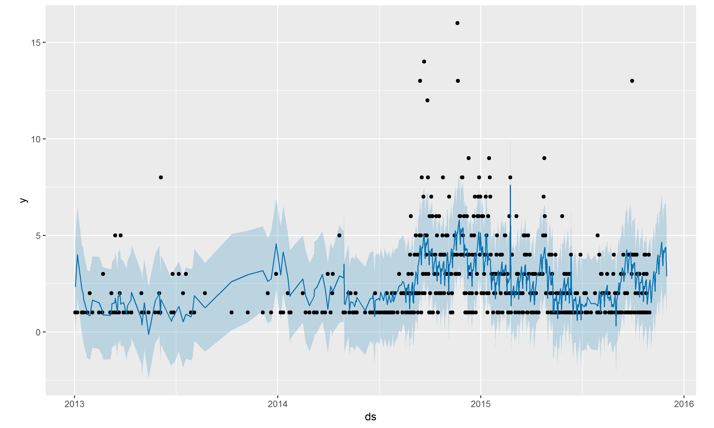

```{r load_packages, include = FALSE}
library("papaja")
library('tidyverse')
library('knitr')
library('kableExtra')
library('lubridate')
options(knitr.table.format = "latex")
load('../cache/not_loaded/item.categories.RData')
load('../cache/not_loaded/items.RData')
load('../cache/not_loaded/shops.RData')
load('../cache/russian_holidays.RData')
```

# Overview of Methodology Used

The input data consists of four files, detailing information about the shops, items, item categories and the daily sales information over Jan 2013 to Oct 2015. The textual data is in Russian, which is converted to English first. After data preparation activities, extensive Exploratory Data Analysis (EDA) is performed on the data. This involved univariate numerical and graphical summaries, multivariate graphical and numerical summaries, and unsupervised time series clustering. The EDA results in insights which feed in to the data preparation step, feature engineering step as well as modeling and post processing steps. A total of 8 models are built including one ensemble model. All the models follow a top-down approach as described later. Some standard model evaluation metrics are used during the model building process, though the final model selected is dependent on the Kaggle score.

# Data Preparation & Exploratory Data Analysis

## Translation

The text fields of the input dataset are in Russian. The first step is to convert these fields into English. This is performed passing the Russian text to a Google Translate API via an R script running on an Amazon Web Services RStudio server. Since a free version of the Translate API is used, the translation activity runs at a speed of ~1 translation per second resulting in an end-to-end runtime of ~3 hours. Post translation, the shop meta data, item category metadata and item level metadata becomes readable and allows for feature engineering. Table 1 shows a sample of `items` translated into English.

```{r}
set.seed(11)
items %>% sample_n(5) %>% kable(caption='Sample Items', booktabs = T) %>% kable_styling(latex_options = c('scale_down','HOLD_position'))
```

## Feature Engineering

Some features are added at the outset simply by investigating and understanding the nature of the data, it's source and geographic region. These features are described below. Additional features, developed after more detailed EDA are described later.

### Categorical Predictors

The `item category` can be split into two levels of information, as shown in table 2. `itemcat_lvl1` is a higher level categorization consisting of 21 different levels _(Cinema, Games, PC Games, Music, Gifts, Movies, Accessories, Books, Programs, Payment Cards, Game Consoles, Office, Elements of a food, Clean media (piece), Delivery of goods, Tickets (figure), Official, Clean carriers (spire), Android games, MAC Games, PC)_, while `itemcat_lvl2` is a lower level categorization consisting of 62 different levels. A sample is shown in table 2.

```{r}
set.seed(10)
item.categories %>% sample_n(5) %>% kable(caption='Sample Item Categories', booktabs=T) %>% kable_styling(latex_options = c('scale_down','HOLD_position'))
```

The `shops` table consists of some location information about the shops. This is split into two categorical predictors as well. `loc_lvl` is a higher level categorization consisting of 32 different levels, while `loc_lvl1` is a deeper categorization consisting of 56 levels. A sample is shown in table 3.

```{r}
set.seed(10)
shops %>% sample_n(5) %>% kable(caption='Sample Shops', booktabs = T) %>% kable_styling(latex_options = c('HOLD_position'),font_size = 11)
```

### Calendar Related Predictors

Temporal predictors are appended to the dataset, viz.,

1. `year`, `month`, `week` describing the year, month and week of the observation
1. `weekend` is a binary 0/1 variable to account for increased sales over a weekend (if any)
1. `ym`, year-month combination
1. `yw`, year-week combination
1. `is_december`, is a binary 0/1 variable to account for increased Christmas / New Year sales (if any)

Russian holiday schedules are downloaded for the years 2013, 2014 and 2015 from 'Holidays in Russia, https://www.timeanddate.com/holidays/russia/2013#!hol=9.' These are filtered to _Official and Non-Working Days_ are joined to the original data. Table 4 shows the 2013 holidays observed in Russia.

```{r message=FALSE, warning=FALSE}
russian_holidays %>% filter(date < ymd('20131231')) %>% kable(caption='2013 Russian Holidays', booktabs = T) %>% kable_styling(latex_options = c('HOLD_position'),font_size = 9)
```

## Data Exploration

EDA is the most important piece of work in the model building exercise as it offers an insight into the underlying structure of the data. Data visualization is a critical piece of this activity. Here is a total set of activities performed:

- Univariate studies
    - Time series plots of `shop_id`, `item_id`, `item_categories`, `locations` and many combinations thereof, aggregated by `year`, `month`, `week`, `day`
    - Histograms, boxplots and density plots of `item_cnt_day` and aggregations thereof, grouped by several categorical variables
- Bivariate studies
    - Correlation plots of various `item_cnt_day` and aggregations thereof, grouped by several categorical variables
- Multivariate studies
    - Scatter plots
    - t-SNE (t-distributed Stochastic Neighbor Embedding), a dimensionality reduction well suited for the visualization of high-dimensional datasets
    - Time series clustering

The more insightful explorations are highlighted below.

### Time Series Exploration

The time series visual plotting is scripted given the vast number of combinations of aggregation periods and categorical variables. Plotter functions save images to the disk, and a visual inspection of ~200 plots result in some key insights.

#### Monthly Aggregations

Monthly aggregation plots like this one for `shop_id` 17 highlighted many shops which closed down in year 2015. This allowed the dataset to be reduced since no forecasts need be developed for these shops.



`shop_id` 38 shows a downward trend in sales year over year, with seasonality showing sales spikes in March, August and December.



#### Weekly Aggregations

These were especially useful in time series clustering described in the next section.

### Time Series Clustering

The `TSClust` package offers unsupervised clustering methods for time series objects. While the package offers several dissimilarty measures, after some investigation, the dissimilarity measure calcuated using a Pearson's correlation coefficient between two time series seemed to offer the best balance between simplicity, intuition, and explanability of the results.

Hierarchical clustering is performed on the dissimilarity matrix on weekly aggregated data using either the _Complete Linkage_ or the _Ward.D2_ algorithm, depending which performs better by visual inspection of the clusters. The results for three categorical variables are shown below with details on how this insights affects subsequent analyses.

#### Item Category - Level 1

The clusters highlighted in red boxes correspond to the color coding of the time series plots. Right away, the power of this approach to isolate or group signals together can be seen.

- _Payment Cards_ and _Office_ both have flatter beginnings with a bulge centering at week 110
- _Delivery of goods_ and _MAC Games_ show spiky behaviour
- _Tickets_, _Official_ and _PC_ only had intermittent sales (possible sales-events), but are zero throughout
- Many of the remainder of the signals (in yellow and gray) show trending and some seasonal behaviour


#### Shop ID

`shop_id` shows five distinct groups of time series. Insights gained from this analyis are:

- The black lines have a clear downward trend component
- The red lines don't have much of a trend
- Shop 36 has just opened up two months ago; not much data there
- The blue lines start midway through the time series
- The cyan lines are much spikier. The spiked identified by the red arrows line up with perfectly with those identified above for _Delivery of goods_, _Tickets_ and _Official_ which helps treat these two shops with some special care before modeling


#### Week Number

The week number clustering returns in very useful insights. Week 53 and Week 1 - at the end and beginning of a year - had drastically different sales patterns. Interestingly, Week 39 was the most different from the rest, and could coincide with a russian holiday.


## Summary of Data Preparation Activities

This is the summary of all the data preparation activities carried out:

- Data cleansing
    - Item categories _Delivery of goods_ is de-spiked
    - Few negative values for `item_cnt_day` were replaced by positive values
    - Text data is cleaned by removing trailing spaces, special characters, case correction and de-duplication

- Data removal
    - 16 out of 60 shops had closed before Oct-2015 and are removed
    - Item categories _Tickets_, _Official_ are one-off sales and are removed

- Feature addition
    - In addition to the features described before, indicator variables for certain week numbers are added

The resulting `master` data frame taken into analysis had 2,413,246 rows and 26 columns. Each analysis technique explored below modified this data frame by aggregation and addition/modification/removal of features.

# Modeling

The modeling approaches used for this project can be classified as a 'Top Down' approach. At a high level, this means:

1. The Nov forecast for each shop (using `shop_id`) is calculated. This may be either on daily, weekly or monthly aggregated data.
1. The next step is to calculate either the `level 1 item category` or the `item_id`, depending on the approach.

A total of 8 models are built including one ensemble model. Each concept tweaks both these steps slighly to build a diverse set of models. The ensemble model is a simple average of the top 3 models.

## Overview of  Approaches

Here is an overview of the models executed for this project.

```{r}
readr::read_csv('model_details.csv',col_names = T, na = ' ') %>% kable(caption='Model Details', booktabs = T) %>% kable_styling(latex_options = c('scale_down','HOLD_position'))
```

A discussion of some of the more interesting approaches follows.

### Concept 3a and 3b

The approach described here in pseudocode roughly applies to concepts C4, C5 and C6 as well. The top-down approach for this concept is as follows:

- Clean and prep that data. Develop the matrix for `xreg` portion of `auto.arima()`
- For each `shop_id`, fit an `auto.arima` model with `seasonal = TRUE`. Forecast out 4 weeks or 1 month, depending on the concept. The 2015-Nov total sales forecast is now ready. (A)
- For each `item_id`, calculate the percent sales of that item per shop. (B)
- Multiply (A) and (B) to estimate the `item_id`'s sales volume for 2015-Nov. (C)
- There will be still a large number of missing values. Here is how to tackle them.
    - Step 1 - Estimate the average item sales per month for each `item_id`. [Essentially, a `meanf` model is used.]
    - Step 2 - Aggregate this average for the year of 2015 and use this average for missing values in (C)
    - Step 3 - For the remainder of missing values, set them to zero
    - Step 4 - Clip the results between 0 and 20

### Concept 4 - Prophet Models

Prophet is a package developed by Facebook for robust, scalable time series forecasting. To quote the package authors, "Prophet is a procedure for forecasting time series data. It is based on an additive model where non-linear trends are fit with yearly and weekly seasonality, plus holidays. It works best with daily periodicity data with at least one year of historical data. Prophet is robust to missing data, shifts in the trend, and large outliers".

The advantage of this package is in it's robustness to outliers and it's ability to handle low-count based data while still operating on un-aggregated daily input data. It's fast and came up with reliable forecasts. For this concept, 573 `shop_id` + `item_category_id` level models are built.

A few examples of these forecasts are shown in figures 7 and 8. Each black point is a daily observation, while the blue lines are the forecasts and prediction intervals.








### Concept 6

## Programming Details

Given the large number of models programmatically fit, as shown in the table below, one of the challenges was to get these to run on a smaller machine, using single core processing. The solution was to move to a 40-core 128GB machine and leverage a `foreach(...) %dopar% {...}` approach using the `doParallel` and `foreach` package. This brough the computation time from ~3-4 hours to ~5-15 minutes.

```{r}
readr::read_csv('model_numbers.csv',col_names = T, na = ' ') %>% kable(caption='Model Details', booktabs = T) %>% kable_styling(latex_options = c('HOLD_position'))
```

# Results Summary

Given the complexity of the code structure required to automate execution and book-keeping of such a large set of models, it was not feasible within the given time frame to book-keep, extract and inspect the traditional metrics of AICc, BIC, RMSE or MASE from each of the `forecast` objects. The models were evaluated based on their test set Kaggle scores. The Kaggle scores themselves represent ~25% of the test data, but give a decent indication of model performance.

```{r}
readr::read_csv('model_results.csv',col_names = T, na = ' ') %>% kable(caption='Model Details', booktabs = T) %>% kable_styling(latex_options = c('HOLD_position'))
```


```{r}
readr::read_csv('model_results.csv',col_names = T, na = ' ') %>% lattice::barchart(`Kaggle Score`~Concept,.)
```


The final two models selected for Kaggle submission are C3a (Weekly aggregated Auto ARIMA) and C7 (Ensemble model of C3a, C4 and C5).

# Limitations

As can be seen from the Kaggle scores, the top-down approach seems to have stabilized at a score of ~1.2, irrespective of the underlying model used - ARIMA, TBATS or STLF for weekly aggregation, or Prophet for daily aggregation. The bottleneck in this approach is surely the subsequent steps of estimation of the the `item_id` forecasts using simple non-trending proportions calculated over the 2015 data. Even upon further parameter tuning (BoxCox transformations, outlier/spike removals, different methods of handling NA values, addition/removal of regressors from `xreg` in `auto.arima()`, different holiday dates etc), the lowest Kaggle score achieved could not be beat, which points to a plateau being hit for this top-down forecasting approach. To improve this score further, some major change needs to occur - either in the preprocessing, or model strategy.

# Future work

These are ideas yet to be explored for this challenge:

- Utilization of 2-layered models where the residuals of one feed into the next model
- Utilization of logistic regression based approaches
- Further hyper parameter tuning of the `Prophet` package calls
- Utilization of machine learning approaches like `xgboost` or `LSTM`
- SVD based approaches are documented to be successful here: https://www.kaggle.com/c/walmart-recruiting-store-sales-forecasting/discussion/8125

# Challenges and learnings

Apart from the computational challenges addressed via parallel computation listed above, the other computational challenge faced was when an xgboost model was attempted at an `item_id` level. Since xgboost can only handle numerical variables, transformation of 8000+ levels to an extremely sparse dummy-matrix (required 308 GB RAM to perform) was not possible. Either this is a computational challenge, or a conceptual weakness on how to correctly use xgboost on my part.

Secondly, all the EDA, plotting and clustering really highlighted the importance of exploration at the front end of any analyses. It also helps tremenously to be strong at a language like R to be able to automate many of these tasks.

\newpage

# R Packages Used

- remedy_0.0.0.9600     
- bindrcpp_0.2.2        
- prophet_0.2.1
- Rcpp_0.12.16          
- doParallel_1.0.11     
- iterators_1.0.9
- foreach_1.4.4
- plotly_4.7.1         
- zoo_1.8-1             
- magrittr_1.5
- Rtsne_0.13
- timeDate_3043.102     
- xgboost_0.6.4.1
- caret_6.0-79
- TSclust_1.2.4
- cluster_2.0.7-1      
- pdc_1.0.3             
- wmtsa_2.0-3
- janitor_1.0.0         
- sweep_0.2.1
- forecast_8.3
- lattice_0.20-35
- lubridate_1.7.4
- plyr_1.8.4           
- reshape2_1.4.3        
- ProjectTemplate_0.8.2
- kableExtra_0.8.0
- knitr_1.20            
- forcats_0.3.0
- stringr_1.3.0
- dplyr_0.7.4
- purrr_0.2.4          
- readr_1.1.1           
- tidyr_0.8.0
- tibble_1.4.2
- ggplot2_2.2.1         
- tidyverse_1.2.1
- papaja_0.1.0.9709    

\newpage

# References

- https://www.jstatsoft.org/article/view/v062i01/v62i01.pdf
- https://peerj.com/preprints/3190.pdf
- https://facebook.github.io/prophet/
- https://www.kaggle.com/c/walmart-recruiting-store-sales-forecasting/discussion/8125
- https://www.kaggle.com/c/walmart-recruiting-store-sales-forecasting/discussion/8033


\begingroup
\setlength{\parindent}{-0.5in}
\setlength{\leftskip}{0.5in}

<div id = "refs"></div>
\endgroup